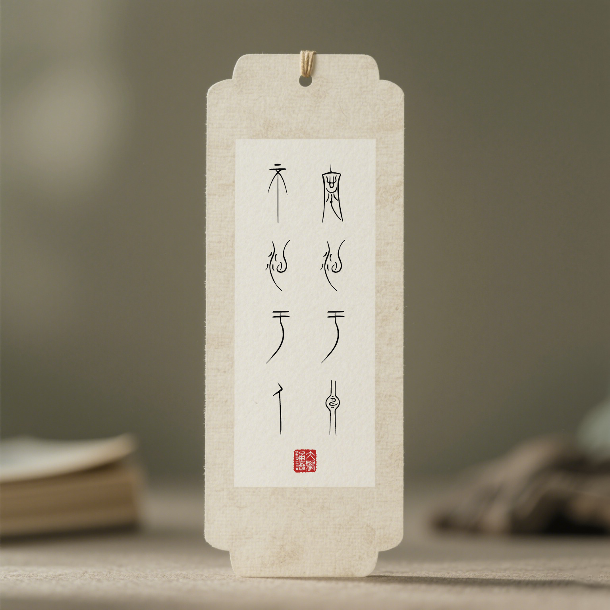
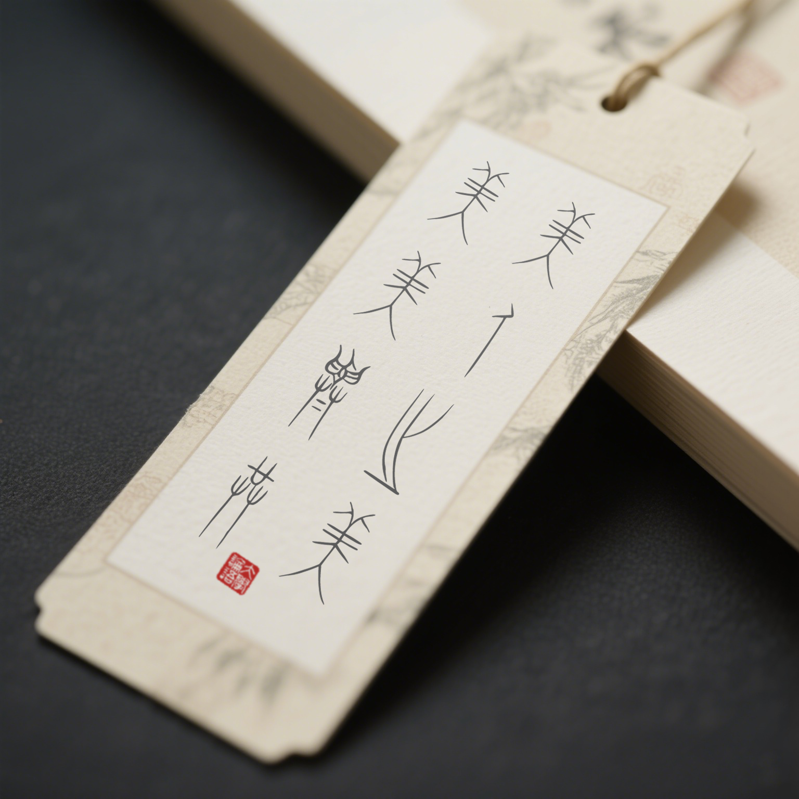

# JFZSKSealScript · 敬峰中山王篆  
## Seal Script of the Zhongshan Kingdom, Jingfeng style

> **字体库名：JFZSKSealScript**  
> **格式：TTF**

“敬峰中山王篆”（*Seal Script of the Zhongshan Kingdom, Jingfeng style*）是一款基于战国时期中山国青铜器铭文风格开发的数字篆书字体。本字体由刘敬峰先生创作，力求在忠实还原历史风格的基础上进行合理的字形补充与数字化呈现。

---

## 📚 简介

本字体以“中山三器”铭文为主要原型，结合战国文字体系、甲骨文、金文等早期书写传统，对缺失字形进行了合理推演与设计补充，最大程度地再现古代篆书之美。

- **v1.0 版本包含约 1600 个汉字**
- 收录“中山三器”中最具代表性的优美字形
- 扩展至《道德经·帛书本》全文单字
- 未来将持续完善字库，提升覆盖度与表现力

- - **v2.0 版本包含约  2300 个汉字**
- 收录“中山三器”中最具代表性的优美字形

- 字库升级至 2327个字符，大约2300个中山王篆单字，内容覆盖《道德经帛书版》、《人教版小学必背古诗》。每个新字基本都有原铭文的痕迹，就像煮新卤水要加点老卤水一样，让中山王篆的古韵不断传承。

- 修正第一版的部分错别字。

-字体结构更加严谨。

---

## 🧩 当前支持内容

- 中山三器代表性字形（约300字）
- 《道德经·帛书本》全文单字（约1600字）
- 《人教版小学必背古诗》
- 支持 Unicode 基本 CJK 汉字编码范围
- TTF 格式，适配主流操作系统与排版软件

---

## 🎨 Picture show
 

  
  
  

---

## 📦 下载

你可以在 [Releases 页面](https://github.com/jeffi369/JFZSKSealScript ) 下载最新版本的字体文件。

---

## 📜 授权协议

本字体采用 [SIL Open Font License 1.1](LICENSE) 授权，欢迎个人与商业用途使用，并鼓励社区参与共建。

> Copyright (c) 2025 Jingfeng Liu (刘敬峰)  深圳, All rights reserved.
> GitHub 项目主页: https://github.com/jeffi369/JFZSKSealScript 
> email: jeffliu667@gmail.com
---

## 💖 致谢

This project would not have been possible without the constant support and understanding of my family. Their patience and encouragement gave me the strength to pursue this creative endeavor.

这个项目离不开我家人始终如一的理解与支持。他们在我长时间投入创作的过程中给予了极大的耐心和鼓励，使我有勇气坚持完成这项工作。

---

## 🤝 贡献与讨论

如果你对中山王篆感兴趣，或希望帮助扩展字库、改进设计，请加入我们！

欢迎提交 Issue 或 Pull Request，也欢迎通过邮件或社交媒体与我联系。

---

## 🔗 相关资源

- 《王茁中山王篆书千字文》，王茁，广西美术出版社
- 《战国中山三器铭文图像》，郝建文，文物出版社
- 《中山篆书法大字典》，张景枝， 北京工艺美术出版社
- 《新编说文解字大全集》，中国华侨出版社 
-  百度搜索
- Github
- Deepseek
- Qwen.ai
- FontForge  字库编辑工具
- Inkscape    矢量字体编辑工具
- https://3d.hebeimuseum.org.cn/sanweiList/zhanguoList/index.html 河北博物院 3d 数字展品
